# Event-Driven Multi-Agent Architecture for Stock Price Prediction
## Design and Evaluation of Multi-Agent Architectures: A Vietnam Case Study

**Author:** Nguyen Minh Duong  
**Student ID:** 23010441  
**Group:** 3

---

## Table of Contents

1. [System Overview](#system-overview)
2. [C4 Model - Level 1: System Context](#c4-level-1-system-context)
3. [C4 Model - Level 2: Container Diagram](#c4-level-2-container-diagram)
4. [C4 Model - Level 3: Component Diagram](#c4-level-3-component-diagram)
5. [C4 Model - Level 4: Code Diagram](#c4-level-4-code-diagram)
6. [Event-Driven Architecture](#event-driven-architecture)
7. [Multi-Agent Architectures](#multi-agent-architectures)
8. [Agent Details](#agent-details)
9. [Data Flow](#data-flow)
10. [Deployment Architecture](#deployment-architecture)

---

## System Overview

### Purpose
An intelligent stock price prediction system using event-driven multi-agent architecture with 6 specialized AI agents, supporting both Vietnamese and international markets.

### Key Components
- **6 Specialized Agents**: PricePredictor, InvestmentExpert, RiskExpert, TickerNews, MarketNews, StockInfo
- **3 Multi-Agent Architectures**: Hierarchical, Round-Robin, Ensemble Voting
- **3 LLM Engines**: Gemini 2.0 Flash, OpenAI GPT-4o, Llama 3.1
- **Real-time Data Sources**: VNStock API, CrewAI, Yahoo Finance
- **Neural Networks**: LSTM with 18 model variants

### Technology Stack
```
Frontend:  Streamlit 1.28+
Backend:   FastAPI 0.104+
AI/ML:     Google Gemini, OpenAI, Llama, TensorFlow
Data:      VNStock 3.2+, yfinance, CrewAI
Analysis:  Pandas, NumPy, Scikit-learn
```

---

## C4 Level 1: System Context

### System Context Diagram


### Key Relationships

**Users:**
- Retail Investors: Basic stock analysis, price predictions, AI chatbot queries
- Professional Traders: Advanced risk assessment (VaR, Beta, Sharpe), multi-timeframe LSTM predictions
- Financial Analysts: Comprehensive reports, market insights, fundamental analysis

**External Systems:**
- VNStock API: Vietnamese market data (37+ stocks: VCB, BID, CTG, FPT, etc.)
- Yahoo Finance: International market data and historical prices
- CrewAI + Serper: Real-time news aggregation from CafeF, VietStock, VCI
- Google Gemini: Primary AI engine with offline fallback capability
- OpenAI GPT-4o: Secondary AI for enhanced multi-model analysis

---

## C4 Level 2: Container Diagram

### Container Architecture


### Container Responsibilities

**User Interface Layer:**
- Streamlit Web App: Interactive UI with 6 tabs (Stock Analysis, Chatbot, VN Market, Stock News, Company Info, Market News)
- FastAPI REST API: RESTful endpoints for programmatic access

**Application Layer:**
- Main Agent: Orchestrates all agents, manages workflows
- Architecture Manager: Implements 3 prediction architectures
- Unified LLM Agent: Manages multiple AI models with fallback

**Agent Layer:**
- 6 specialized agents for different analysis tasks
- Each agent is autonomous and event-driven

**Data Layer:**
- VNStock API Client: Vietnamese market data
- CrewAI Collector: Real-time news aggregation
- Cache: Performance optimization

---

## C4 Level 3: Component Diagram

### Main Agent Components


### PricePredictor Agent Components


### InvestmentExpert Agent Components


### RiskExpert Agent Components


---

## C4 Level 4: Code Diagram

### PricePredictor Class Structure

```python
class PricePredictor:
    # Attributes
    - name: str
    - vn_api: VNStockAPI
    - stock_info: StockInfoDisplay
    - ai_agent: UnifiedLLMAgent
    - lstm_predictor: LSTMPricePredictor
    - prediction_periods: dict
    
    # Core Methods
    + predict_price_enhanced(symbol, days, risk_tolerance, time_horizon, investment_amount)
    + predict_comprehensive(symbol, vn_api, stock_info)
    
    # Private Methods
    - _predict_vn_stock(symbol, vn_api)
    - _predict_international_stock(symbol)
    - _calculate_advanced_indicators(data)
    - _analyze_market_trend(data, predictions)
    - _generate_multi_timeframe_predictions(data, indicators, ml_predictions)
    - _apply_ml_predictions(data, indicators)
    - _calculate_confidence_scores(data, indicators, ml_predictions)
    - _analyze_risk_metrics(data)
    - _generate_recommendations(predictions, confidence_scores, risk_analysis)
    
    # Helper Methods
    - _calculate_trend_multiplier(indicators, rsi, bb_position)
    - _calculate_base_change(days, volatility, trend_multiplier)
    - _calculate_rsi_adjustment(rsi, days)
    - _calculate_bb_adjustment(bb_position, days)
    - _combine_lstm_with_traditional(lstm_result, symbol)
    - _get_risk_adjusted_analysis(result, risk_tolerance, time_horizon, investment_amount)
    - _get_ai_price_analysis(symbol, technical_data, days, risk_tolerance, time_horizon)
```

### InvestmentExpert Class Structure

```python
class InvestmentExpert:
    # Attributes
    - name: str
    - _vn_api: VNStockAPI
    - ai_agent: UnifiedLLMAgent
    
    # Core Methods
    + analyze_stock(symbol, risk_tolerance, time_horizon, investment_amount)
    + analyze_investment_decision(symbol)
    
    # Analysis Methods
    - _analyze_financial_metrics(metrics)
    - _analyze_technical_indicators(metrics)
    - _analyze_valuation(metrics)
    - _calculate_investment_score(financial, technical, valuation)
    - _make_investment_recommendation(score)
    
    # Data Methods
    - _fetch_real_detailed_metrics(symbol)
    - _generate_detailed_metrics(stock_data, symbol)
    - validate_metrics(metrics)
    
    # Profile Methods
    - _adjust_analysis_for_profile(base_analysis, risk_tolerance, time_horizon, investment_amount)
    - _get_risk_profile_name(risk_tolerance)
    - _calculate_max_position(risk_tolerance)
    - _get_time_horizon_days(time_horizon)
    
    # AI Methods
    + get_ai_enhancement(symbol, base_analysis)
    - _create_diverse_investment_context(symbol, base_analysis, risk_tolerance, time_horizon, investment_amount, risk_profile)
    - _create_diverse_investment_advice(symbol, base_analysis, risk_tolerance, time_horizon, investment_amount)
    - _parse_ai_advice(ai_response)
```

### MainAgent Class Structure

```python
class MainAgent:
    # Attributes
    - vn_api: VNStockAPI
    - stock_info: StockInfoDisplay
    - price_predictor: PricePredictor
    - ticker_news: TickerNews
    - market_news: MarketNews
    - investment_expert: InvestmentExpert
    - risk_expert: RiskExpert
    - international_news: InternationalMarketNews
    - llm_agent: UnifiedLLMAgent
    - architecture_manager: ArchitectureManager
    
    # Core Methods
    + analyze_stock(symbol, risk_tolerance, time_horizon, investment_amount)
    + get_market_overview()
    + process_query(query, symbol)
    
    # Configuration Methods
    + set_llm_keys(gemini_api_key, openai_api_key, llama_api_key, llama_base_url)
    + set_crewai_keys(gemini_api_key, openai_api_key, llama_api_key, llama_base_url, serper_api_key)
    
    # Architecture Methods
    + predict_price_with_architecture(symbol, architecture, timeframe)
    + compare_architectures(symbol, timeframe)
    + get_architecture_info()
    + get_architecture_performance()
    
    # Helper Methods
    - _integrate_llm_with_agents()
    - _safe_get_price_prediction(symbol)
    - _safe_get_ticker_news(symbol, limit)
    - _safe_get_investment_analysis(symbol, risk_tolerance, time_horizon, investment_amount)
    - _safe_get_risk_assessment(symbol, risk_tolerance, time_horizon, investment_amount)
    - _get_error_fallback(task_name, symbol, error)
    - _is_valid_international_symbol(symbol)
    - _get_risk_profile_name(risk_tolerance)
```

---

## Event-Driven Architecture

### Event Flow Overview


### Event Types

**User Events:**
- `ANALYZE_STOCK`: Trigger comprehensive stock analysis
- `PREDICT_PRICE`: Request price prediction
- `ASSESS_RISK`: Request risk assessment
- `GET_NEWS`: Fetch stock/market news
- `QUERY_AI`: Ask AI chatbot

**System Events:**
- `DATA_FETCH_START`: Begin data retrieval
- `DATA_FETCH_COMPLETE`: Data retrieval finished
- `AGENT_EXECUTION_START`: Agent begins processing
- `AGENT_EXECUTION_COMPLETE`: Agent finishes processing
- `AI_ENHANCEMENT_START`: AI analysis begins
- `AI_ENHANCEMENT_COMPLETE`: AI analysis finished
- `ERROR_OCCURRED`: Error handling triggered

**Data Events:**
- `PRICE_UPDATE`: New price data available
- `NEWS_UPDATE`: New news articles available
- `METRIC_UPDATE`: Financial metrics updated
- `CACHE_HIT`: Data retrieved from cache
- `CACHE_MISS`: Data fetched from source


---

## Multi-Agent Architectures

### Overview: Three Architecture Patterns


### Architecture Characteristics Summary

| Characteristic | Hierarchical | Round-Robin | Ensemble Voting |
|---------------|--------------|-------------|------------------|
| **Pattern** | Coordinator-Worker | Sequential Pipeline | Parallel Voting |
| **Execution** | Parallel → Aggregate | Sequential Chain | Parallel → Bayesian |
| **Communication** | Hub-and-Spoke | Linear Chain | Broadcast-Collect |
| **Speed** | ⚡⚡ Medium (2-3s) | ⚡ Slow (4-6s) | ⚡⚡⚡ Fast (1-2s) |
| **Accuracy** | ⭐⭐⭐ Good (75-80%) | ⭐⭐⭐⭐ Very Good (80-85%) | ⭐⭐⭐⭐⭐ Excellent (85-90%) |
| **Robustness** | ❌ Low (SPOF) | ⚠️ Medium | ✅ High |
| **Scalability** | ⚠️ Limited | ❌ Poor | ✅ Excellent |
| **Complexity** | 🟢 Low | 🟡 Medium | 🔴 High |
| **Uncertainty** | ❌ Not quantified | ❌ Not quantified | ✅ Quantified (±range) |
| **Best Use Case** | Simple analysis | Iterative refinement | Complex predictions |
| **Failure Mode** | Coordinator fails → All fail | One agent fails → Chain breaks | One agent fails → Others compensate |

### Agent Roles Across Architectures

```mermaid
graph LR
    subgraph "6 Specialized Agents"
        A1[🔮 PricePredictor<br/>LSTM + Technical<br/>Weight: 25%]
        A2[💼 InvestmentExpert<br/>Fundamental Analysis<br/>Weight: 20%]
        A3[⚠️ RiskExpert<br/>Risk Assessment<br/>Weight: 20%]
        A4[📰 TickerNews<br/>Stock News<br/>Weight: 15%]
        A5[🌍 MarketNews<br/>Market Trends<br/>Weight: 10%]
        A6[🏢 StockInfo<br/>Company Data<br/>Weight: 10%]
    end
    
    subgraph "Data Sources"
        VN[VNStock API]
        YF[Yahoo Finance]
        CREW[CrewAI]
        AI[Gemini/OpenAI]
    end
    
    A1 --> VN
    A1 --> YF
    A2 --> VN
    A3 --> VN
    A4 --> CREW
    A5 --> CREW
    A6 --> VN
    
    A1 --> AI
    A2 --> AI
    A3 --> AI
```



### Architecture 1: Hierarchical (Big Agent)


**Characteristics:**
- **Coordination**: Big Agent coordinates all sub-agents
- **Aggregation**: Results combined with weighted scoring
- **Decision**: Single point of decision-making
- **Pros**: Clear hierarchy, easy to understand, centralized control
- **Cons**: Single point of failure, bottleneck at coordinator

**Implementation:**
```python
# design_1_hierarchical.py
class HierarchicalPricePredictionSystem:
    async def predict_price(self, symbol, timeframe):
        # Step 1: Collect from all agents
        results = await self._collect_agent_predictions(symbol)
        
        # Step 2: Aggregate with weights
        aggregated = self._aggregate_results(results)
        
        # Step 3: Make final decision
        final = self._make_final_decision(aggregated)
        
        return final
```

### Architecture 2: Round-Robin (Sequential Improvement)


**Characteristics:**
- **Sequential**: Each agent refines previous agent's output
- **Iterative**: Continuous improvement through pipeline
- **Cumulative**: Knowledge builds up through chain
- **Pros**: Progressive refinement, each agent adds value
- **Cons**: Slower execution, error propagation

**Implementation:**
```python
# design_2_round_robin.py
class RoundRobinPricePredictionSystem:
    async def predict_price(self, symbol, timeframe):
        prediction = self._initial_prediction(symbol)
        
        # Sequential refinement
        for agent in self.agents:
            prediction = await agent.refine(prediction, symbol)
        
        return prediction
```

### Architecture 3: Ensemble Voting (Bayesian Inference)

```mermaid
graph TB
    subgraph "Ensemble Voting Architecture"
        subgraph "Layer 1: Parallel Agent Execution"
            A1[Agent 1: PricePredictor<br/>Vote: 1250 VND<br/>Confidence: 0.85<br/>Weight: High]
            A2[Agent 2: InvestmentExpert<br/>Vote: 1280 VND<br/>Confidence: 0.75<br/>Weight: Medium]
            A3[Agent 3: RiskExpert<br/>Vote: 1230 VND<br/>Confidence: 0.90<br/>Weight: High]
            A4[Agent 4: TickerNews<br/>Vote: 1260 VND<br/>Confidence: 0.70<br/>Weight: Medium]
            A5[Agent 5: MarketNews<br/>Vote: 1270 VND<br/>Confidence: 0.65<br/>Weight: Low]
            A6[Agent 6: StockInfo<br/>Vote: 1240 VND<br/>Confidence: 0.80<br/>Weight: Medium]
        end
        
        subgraph "Layer 2: Bayesian Inference Engine"
            BAYES[Bayesian Aggregator<br/>- Prior: Market price distribution<br/>- Likelihood: Agent predictions<br/>- Posterior: Weighted combination<br/>- Confidence: Uncertainty quantification]
        end
        
        subgraph "Layer 3: Statistical Analysis"
            STATS[Statistical Processor<br/>- Mean calculation<br/>- Variance estimation<br/>- Confidence intervals<br/>- Outlier detection]
        end
        
        subgraph "Layer 4: Final Output"
            FINAL[Final Prediction<br/>Price: 1255 VND<br/>Confidence: 0.88<br/>Uncertainty: ±25 VND<br/>Range: 1230-1280]
        end
    end
    
    A1 -->|Vote + Confidence| BAYES
    A2 -->|Vote + Confidence| BAYES
    A3 -->|Vote + Confidence| BAYES
    A4 -->|Vote + Confidence| BAYES
    A5 -->|Vote + Confidence| BAYES
    A6 -->|Vote + Confidence| BAYES
    
    BAYES -->|Posterior distribution| STATS
    STATS -->|Statistical summary| FINAL
```



**Characteristics:**
- **Parallel**: All agents execute simultaneously
- **Voting**: Each agent provides prediction + confidence
- **Bayesian**: Statistical inference for final decision
- **Weighted**: Higher confidence = more influence
- **Pros**: Robust, handles disagreement, quantifies uncertainty
- **Cons**: Complex implementation, requires calibration

**Implementation:**
```python
# design_3_ensemble_voting.py
class EnsembleVotingPricePredictionSystem:
    async def predict_price(self, symbol, timeframe):
        # Parallel execution
        predictions = await asyncio.gather(*[
            agent.predict(symbol) for agent in self.agents
        ])
        
        # Bayesian inference
        final = self._bayesian_aggregation(predictions)
        
        return final
    
    def _bayesian_aggregation(self, predictions):
        # Weight by confidence
        weights = [p['confidence'] for p in predictions]
        prices = [p['price'] for p in predictions]
        
        # Weighted average
        final_price = np.average(prices, weights=weights)
        
        # Uncertainty quantification
        uncertainty = np.std(prices)
        
        return {
            'price': final_price,
            'confidence': np.mean(weights),
            'uncertainty': uncertainty
        }
```

### Architecture Comparison

| Feature | Hierarchical | Round-Robin | Ensemble Voting |
|---------|-------------|-------------|-----------------|
| **Execution** | Parallel → Sequential | Sequential | Parallel |
| **Speed** | Medium | Slow | Fast |
| **Accuracy** | Good | Very Good | Excellent |
| **Robustness** | Low | Medium | High |
| **Complexity** | Low | Medium | High |
| **Uncertainty** | Not quantified | Not quantified | Quantified |
| **Best for** | Simple tasks | Refinement tasks | Complex predictions |

---

## Agent Details

### Agent 1: PricePredictor

**Purpose:** Predict future stock prices using LSTM neural networks and technical analysis

**Key Features:**
- 18 LSTM model variants
- Multi-timeframe predictions (1d, 7d, 30d, 90d, 180d, 365d)
- 20+ technical indicators (RSI, MACD, Bollinger Bands, etc.)
- Machine learning enhancements
- Confidence scoring
- AI-enhanced analysis

**Data Flow:**


**Output Structure:**
```json
{
  "symbol": "VCB",
  "current_price": 108000,
  "predicted_price": 112000,
  "change_percent": 3.7,
  "confidence": 85.5,
  "method_used": "LSTM Primary",
  "predictions": {
    "short_term": {"1_days": {...}, "7_days": {...}},
    "medium_term": {"30_days": {...}, "60_days": {...}},
    "long_term": {"90_days": {...}, "180_days": {...}}
  },
  "technical_indicators": {...},
  "trend_analysis": {...},
  "ai_advice": "...",
  "ai_reasoning": "..."
}
```

### Agent 2: InvestmentExpert

**Purpose:** Provide BUY/SELL/HOLD recommendations based on fundamental and technical analysis

**Key Features:**
- Financial metrics analysis (P/E, P/B, EPS, Dividend)
- Technical analysis (52-week range, volume, beta)
- Valuation analysis (Forward P/E, payout ratio)
- Risk-adjusted recommendations
- Profile-based position sizing
- AI-enhanced advice

**Analysis Components:**


**Scoring Logic:**
```
Total Score = Financial(40%) + Technical(30%) + Valuation(30%)

Recommendation:
- 80-100: STRONG BUY (Confidence: 90%)
- 70-79:  BUY (Confidence: 80%)
- 60-69:  WEAK BUY (Confidence: 60%)
- 50-59:  HOLD (Confidence: 50%)
- 40-49:  WEAK SELL (Confidence: 60%)
- 0-39:   SELL (Confidence: 80%)
```

### Agent 3: RiskExpert

**Purpose:** Assess investment risk using advanced metrics

**Key Features:**
- Value at Risk (VaR) 95%
- Volatility calculation
- Beta (market correlation)
- Sharpe ratio
- Maximum drawdown
- Risk-adjusted position sizing
- AI-enhanced risk advice

**Risk Metrics:**


**Risk Classification:**
```
Volatility-based:
- < 15%: Low Risk
- 15-25%: Medium Risk
- 25-40%: High Risk
- > 40%: Very High Risk

Position Sizing:
- Conservative (risk ≤ 30): Max 5% position
- Balanced (risk 31-70): Max 10% position
- Aggressive (risk > 70): Max 20% position
```

### Agent 4: TickerNews

**Purpose:** Crawl and analyze stock-specific news

**Key Features:**
- Multi-source crawling (CafeF, VietStock, VCI)
- CrewAI integration for real-time news
- Sentiment analysis
- Priority detection
- AI-enhanced summaries

**News Pipeline:**


### Agent 5: MarketNews

**Purpose:** Provide market-wide news with risk-based filtering

**Key Features:**
- Risk-based news filtering
- Underground news (F319, F247, Facebook groups)
- Official news (CafeF, VnEconomy, DanTri)
- Sentiment analysis
- AI-enhanced market insights

**News Categories:**

```mermaid
graph TB
    INPUT[Risk Profile] -->|Route| FILTER{Risk Filter}
    
    FILTER -->|Conservative<br/>Risk ≤ 30| OFF[Official News Only<br/>CafeF, VnEconomy, DanTri]
    FILTER -->|Balanced<br/>Risk 31-70| MIX[Mixed News<br/>Official + Selected Underground]
    FILTER -->|Aggressive<br/>Risk > 70| ALL[All News<br/>Official + Underground]
    
    OFF -->|Fetch| NEWS1[News Articles]
    MIX -->|Fetch| NEWS2[News Articles]
    ALL -->|Fetch| NEWS3[News Articles]
    
    NEWS1 -->|Analyze| SENT[Sentiment Analysis]
    NEWS2 -->|Analyze| SENT
    NEWS3 -->|Analyze| SENT
    
    SENT -->|Enhance| AI[AI Market Insights<br/>Trend analysis<br/>Impact assessment]
    
    AI -->|Output| FINAL[Market News]
```


### Agent 6: StockInfo

**Purpose:** Display comprehensive company information

**Key Features:**
- Real-time stock data
- Financial ratios (P/E, P/B, EPS, ROE, ROA)
- Company overview
- Interactive charts
- Professional presentation

**Data Structure:**


